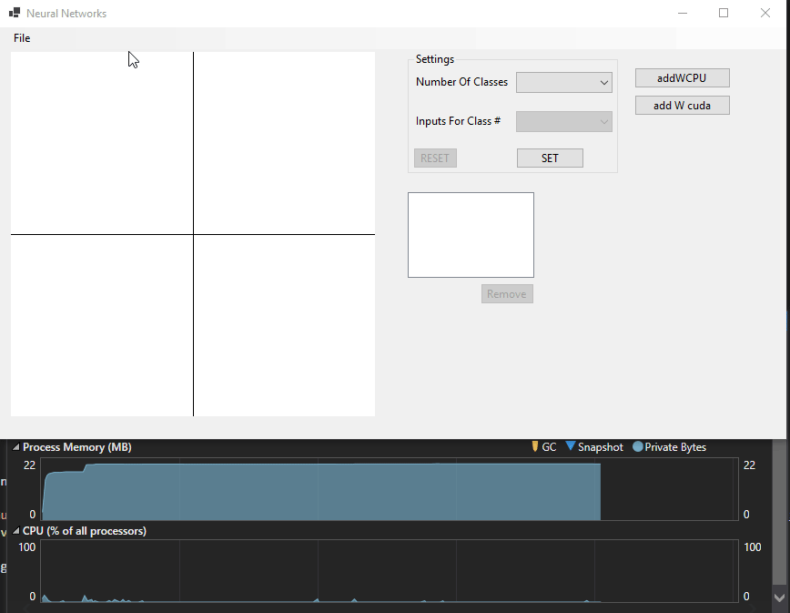
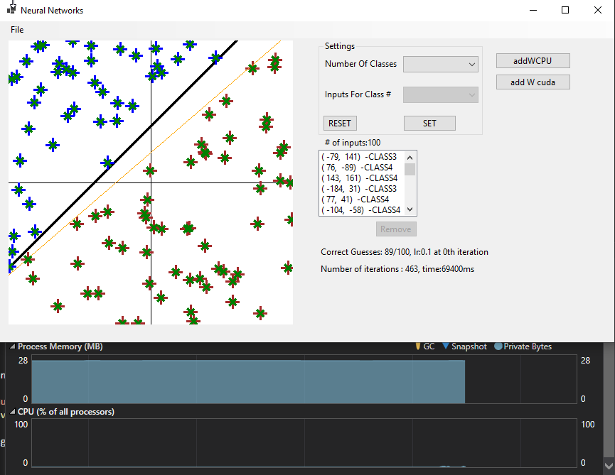
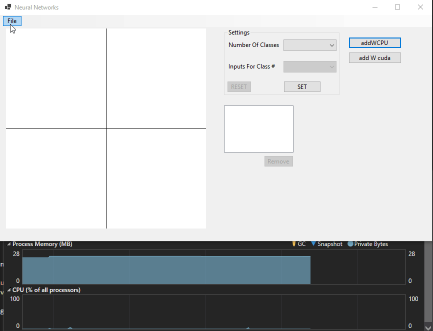

# Neural Networks Visualizer
This software demonstrates the Neural Network learning process.

## Built With
* **Cudalib.dll:** Native C++ with ***CUDA 11.4*** Runtime configuration(**No CLR**)
* **CPULib.dll:** .NET 5 Class Library project.
* **WinFormsAppWCUDA.exe:** WinForms app with .NET5. Depends on CPULib and CudaLib. CudaLib.dll copied after build event.
## Multithreading

Project has UI and training threads ***separated.*** This way app won't become unresponsive during training.

| Auto training thread | Guessed Separating line after training|
|:----------------:|:----------------:|
|||

## XOR Example

**Hello World** example of Neural Networks. Mapping pixels on picture box from left to right and top to bottom: (0,0) (0,1), (1,0)(1,1)

## TODO List

* [x] Make a basic Matrix library(c#).

* [x] Make template Matrix Library Native(C++).
* [x] Link Native library to WinForms app dynamically.
* [x] Generate **1 Million** elements-wise sum example.(Both Native GPU and CPU)
* [x] Make Basic Classifier UI with number of classes.
* [x] Make Sample points on Cartesian Space.
* [x] Implement basic perceptron separator.
* [x] Implement step-by-step Training algorithm(Train button)
* [x] Add threads for training process.
* [x] Add hidden Layer.
* [x] Implement basic 2-Class separator(auto train button)
* [x] Implement stochastic gradient descent
* [ ] Add deep neural nets
* [ ] Add Matrix multiplication kernel( Native GPU )

## References

[Introduction to Artificial Neural Systems](https://www.amazon.com/Introduction-Artificial-Neural-Systems-Zurada/dp/0314933913)

[The Coding Train Neural Networks JS Library Playlist](https://www.youtube.com/playlist?list=PLRqwX-V7Uu6aCibgK1PTWWu9by6XFdCfh)

[CUDA Programming Guide](https://docs.nvidia.com/cuda/cuda-c-programming-guide/index.html)

[Native Interoperability](https://docs.microsoft.com/en-us/dotnet/standard/native-interop/pinvoke)

